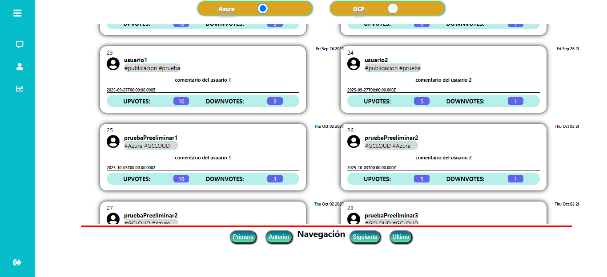
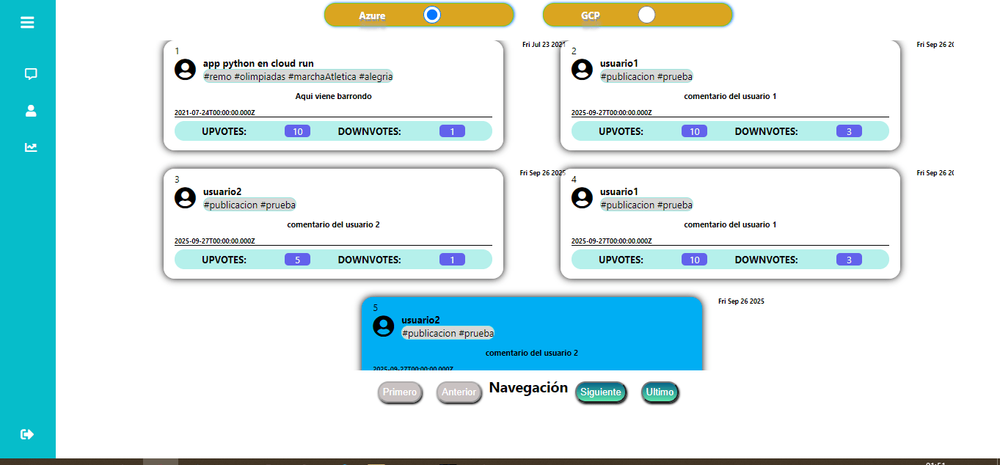
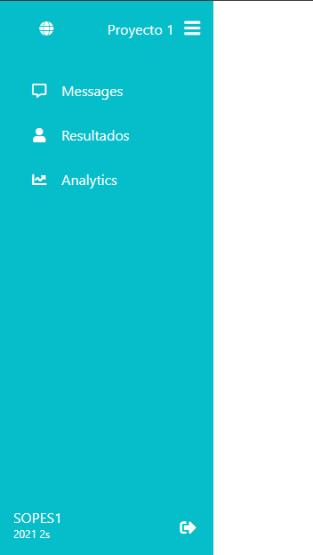
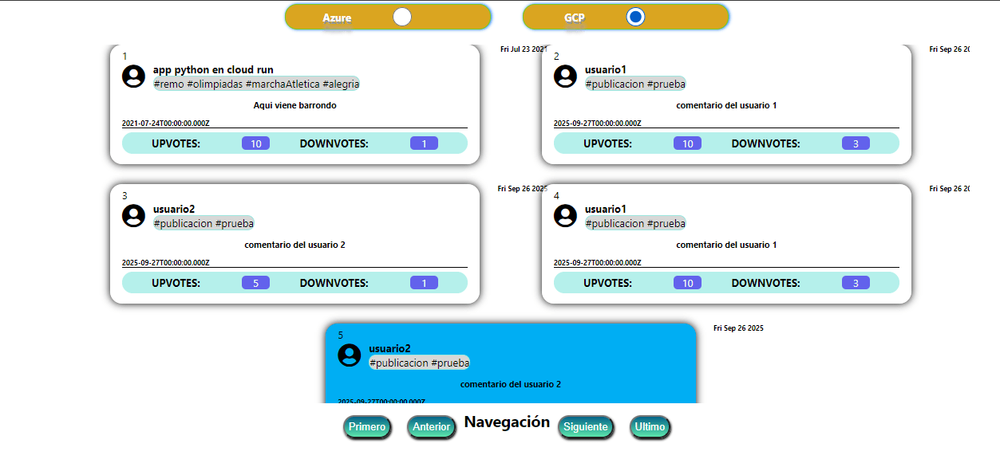
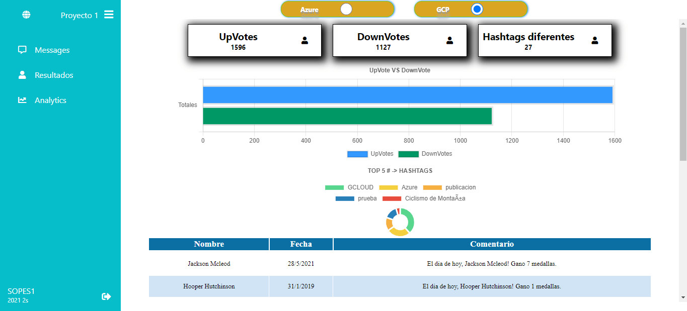
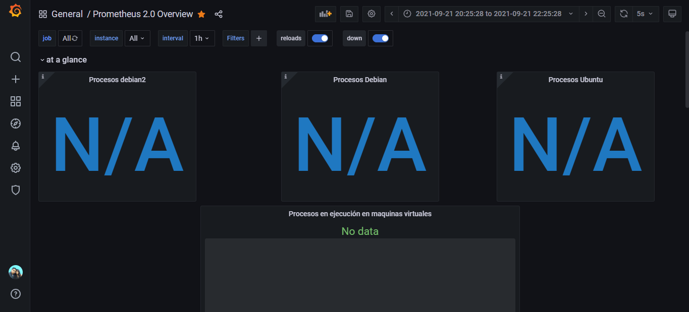

# OLYMPICS GAME NEWS
    
Olympycs Game news es un sitio de noticias sobre los juegos olimpicos. 
    
   - Tenemos una vista similar a Twitter, donde veremos las actualizaciónes en tiempo real de las noticias que se publican a cualquier hora. 
    
   - Nuestras vistas se recargan automaticamente cuando detecta que la ultima noticia listada se mostrara, con el fin de que el usuario pueda seguir viendo los post sin más que deslizar hacia abajo. 

  
`En nuestra aplicación también contamos con una vista de resultados, para visualizar estadisticas sobre los datos que se han actualizado en el sistema.` 
  
`También contamos con un sistema de monitoreo en tiempo real, para evaluar el consumo de ram y cpu de nuestros servidores.` 
  

## Selección de base de datos. 

**Nuestro sistema cuenta con 2 bases de datos donde guardamos todos los registros que se visualizan en nuestro dashboard. En la parte superior podemos seleccionar desde que fuente deseamos ver los datos y estadisticas.**

## Estadisticas

`Nuestras estadisticas principales son: `
    1. Conteo de Hashtags diferentes en el sistema
    2. Conteo de Upvote y DownVotes globales 
    
    3. Top 5 de los Hashtags más mencionados en los posts.
    
    4. Ultimas noticias registradas en el sistema. 

## Monitoreo 

-> En nuestro sistema de monitoreo, mediante los dashboard de grafana, vemos los datos almacenados en Prometheus, el cual realiza peticiones a nuestros servidores con el fin de tener los parametros de consumo más importantes. 

