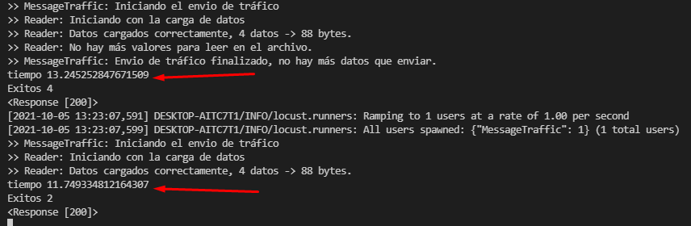
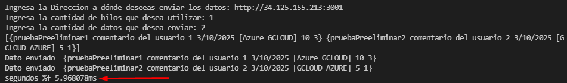
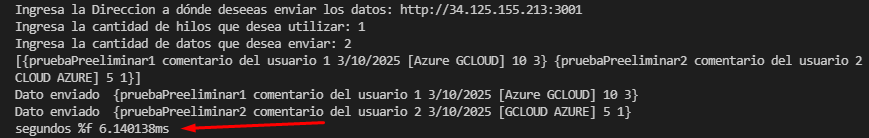
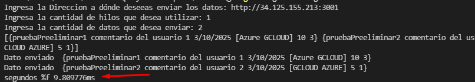
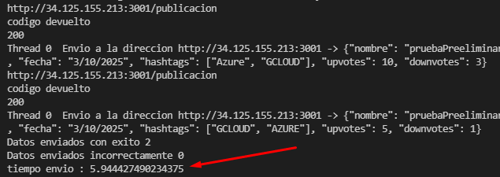
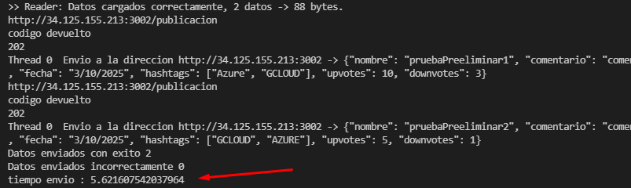
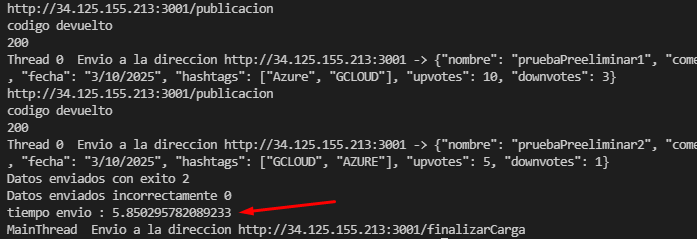

# proyecto1-sopes1

# Preguntas de reflexion

1. **¿Qué generador de tráfico es más rápido? ¿Qué diferencias hay entre las implementaciones de los generadores de tráfico?**

> Generador locust: tiempo medio = 12.497 segundos

> Generador Go: tiempo medio = 7.305 segundos

> Generador Python: tiempo medio = 5.80 segundos

`Como resultado final, se obtuvo un mejor tiempo de respuesta en el generador de python, sobre los otros 2. A pesar de que locust corre sobre python, implementa otras funciones que consumen tiempo y retrasan el envio de datos.`

2. **¿Qué lenguaje de programación utilizado para las APIs fue más óptimo con relación al tiempo de
respuesta entre peticiones? ¿Qué lenguaje tuvo el performance menos óptimo?**

El lenguaje de GO fue el mas optimo, los tiempos de respuestas eran menor comparandolo con python y por lo que python fue el lenguaje menos optimo en cuanto a los tiempos de esperas.

3. **¿Cuál de los servicios de Google Cloud Platform fue de mejor para la implementación de las APIs? ¿Cuál
fue el peor? ¿Por qué?**

Consideramos que el mejor fue utilizar directamente una maquina virtual, las maquinas virutales no nos dieron problemas en cuanto a la instalacion de los modulos necesarios para cada api.
Mientras que por otro lado el uso de servicios como cloud run genero mucho problema con los modulos de python y realizar la conexion con las bases de datos, ya que solicita tener instalado paquetes que por lo general no trae una imagen.
Por parte de cloud functions, es un error pensar en montar un api completa con ella, no fue creada para eso. Ademas que no daba mucha retroalimentacion en cuanto a los errores.

4. **¿Considera que es mejor utilizar Containerd o Docker y por qué?**

Consideramos que es mejor docker, al final pues viene siendo similares y no vale el esfuerzo o el trabajo extra que se realizar en containerd para obtener el mismo resultado con docker, ademas de que docker posee una comunidad muy grande y que se mantiene activa dando actualizaciones a las distintas imagenes.

6. **Considera de utilidad la utilización de Prometheus y Grafana para crear dashboards, ¿Por qué?**

INICIALMENTE creíamos que su implementación era muy complicada, sin embargo resulto ser todo lo contrario, además los usos que se le puede dar son varios y los resultados que podemos ver en Grafana son  